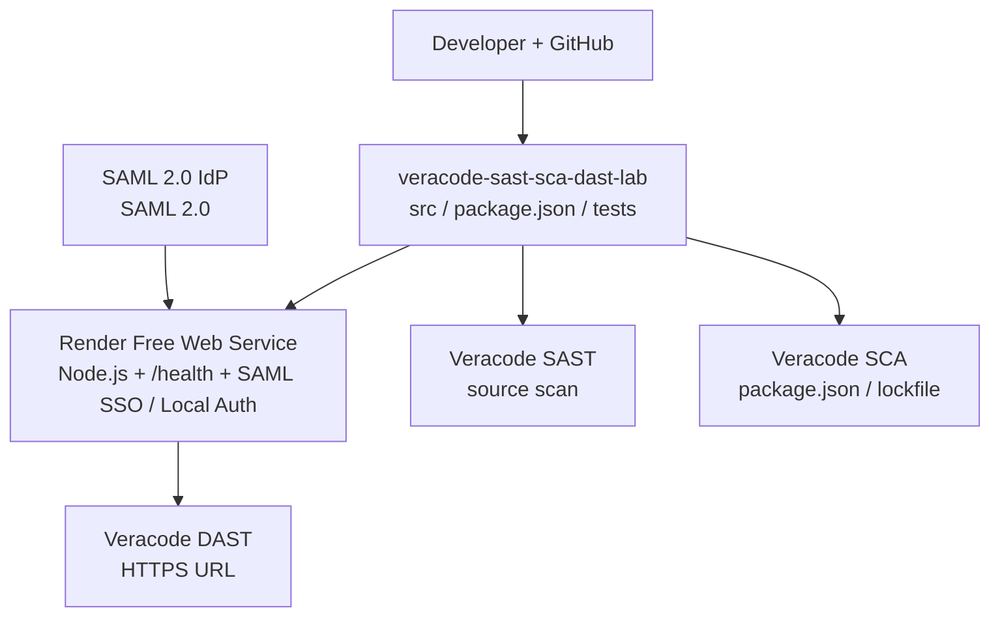

# AppSec Test Lab

> **Independent security engineering lab — not an official Veracode product.**
> Synthetic OWASP Top 10 vulnerabilities with runtime safety guards. Every flaw ships with a secure alternative. Do not use in production or with real data.

Application security testing laboratory — intentionally vulnerable Node.js/Express lab for demonstrating **Veracode SAST**, **SCA**, and **DAST** together against the [OWASP Top 10](https://owasp.org/Top10/) — plus API, dependency, and CI/CD security gates. Every vulnerability is synthetic, governed by runtime safety guards, and shipped with a secure alternative for before/after comparison.

> Designed for Veracode SAST/SCA/DAST testing — branded **AppSec Test Lab**.

> **Controlled lab — do NOT use in production or expose to real data.**

## Architecture



<details>
<summary>ASCII fallback</summary>

```
Laptop (OpenCode + GitHub + Render MCP + Veracode)
  │
  ├─ GitHub ── veracode-sast-sca-dast-lab (this repo)
  │              ├─ src/        vulnerable + secure variants
  │              ├─ package.json / package-lock.json  (SCA)
  │              └─ tests/
  │
  ├─ Render Free Web Service (Node.js)
  │              └─ https://<service>.onrender.com  (/health, /login, …)
  │                    └─ SAML 2.0 IdP (or Local auth)
  │
  └─ Veracode
                 ├─ SAST → GitHub source
                 ├─ SCA  → package.json + package-lock.json
                 └─ DAST → Render HTTPS URL
```
</details>

## Technology

Node.js 20+, Express 4, EJS, `node:sqlite` (built-in), `express-session`, **SAML 2.0** via `@node-saml/node-saml` (replaced OIDC in v1.5), Axios/node-fetch for SSRF demo, synthetic lodash/minimist/jsonwebtoken etc. pinned at historically-vulnerable versions for SCA.

## Prerequisites

- **Node.js 20+** and **npm** (for local) *or* **Docker** (for container)
- Git, and a SAML 2.0 IdP app registration (e.g., Microsoft Entra ID SAML) *only* if you want SSO

## Installation

```bash
git clone https://github.com/induwaran/veracode-sast-sca-dast-lab.git
cd veracode-sast-sca-dast-lab
cp .env.example .env   # then edit .env — see Environment below
```

### Environment (.env)

| Variable | Required | Purpose |
|---|---:|---|
| `NODE_ENV` | no | `development` locally, `production` on Render/Docker |
| `PORT` | no | defaults to `3000` (Render injects `10000`) |
| `BASE_URL` | SSO only | e.g. `http://localhost:3000` or `https://<service>.onrender.com` — SAML ACS is `BASE_URL + /auth/saml/callback` |
| `SESSION_SECRET` | yes | `node -e "console.log(require('crypto').randomBytes(32).toString('hex'))"` |
| `ADMIN_EMAIL` | no | `dast-admin@example.com` style — decides `/admin` access |
| `LOCAL_AUTH_ENABLED` | no | `true` (default) |
| `LOCAL_USER_PASSWORD` / `LOCAL_ADMIN_PASSWORD` | local DAST | lab-only synthetic passwords for `dast-user@example.test` / `dast-admin@example.test` (also `admin@example.com`/`Pass@!23` is seeded) |
| `SAML_ENTRY_POINT` / `SAML_ISSUER` / `SAML_IDP_CERT` (+ `SAML_CALLBACK_URL`) | SSO only | SAML IdP SSO URL, entity ID, X.509 cert — see `SAML-CONFIGURATION.md` |

Only `.env.example` is committed — never commit `.env`.

## Running — Local (npm)

```bash
npm install
npm test        # 18 tests — health, SAST units, local+SSO auth, headers
npm audit       # 23 vulns (5 low,2 mod,12 high,4 crit) on the hardened baseline
npm start       # http://localhost:3000
curl http://localhost:3000/health
```

## Running — Docker (internal host)

The `Dockerfile` (`node:20-alpine`, `npm ci`, `EXPOSE 3000`, `CMD ["npm","start"]`) is ready for any internal host — no Entra required for local DAST (use Local Login).

```bash
# build
docker build -t veracode-lab .

# run with .env file (recommended)
docker run -d --name veracode-lab -p 3000:3000 --env-file .env veracode-lab

# or inline (lab-only)
docker run -d --name veracode-lab -p 3000:3000 \
  -e NODE_ENV=production \
  -e BASE_URL=http://localhost:3000 \
  -e SESSION_SECRET=$(node -e "console.log(require('crypto').randomBytes(32).toString('hex'))") \
  veracode-lab

# persist SQLite across restarts
docker run -d --name veracode-lab -p 3000:3000 --env-file .env -v $(pwd)/data:/app/data veracode-lab

# compose alternative
# services:
#   web:
#     build: .
#     ports: ["3000:3000"]
#     env_file: .env
#     volumes: ["./data:/app/data"]

docker logs -f veracode-lab
curl http://localhost:3000/health
```

Public routes need no login: `/`, `/health`, `/login`, `/login/local`, `/login/sso`, `/auth/saml/callback`, `/logout`.
Protected routes redirect to `/login`. Authentication offers **Local Authentication** and **SAML SSO**, both populating a common session (`authMethod: "local" | "saml"`). Synthetic lab accounts: `dast-user@example.test` / `dast-admin@example.test` and `admin@example.com`/`Pass@!23`. Dashboard shows the method for DAST evidence.

## Auth

**Local Authentication** (email + password, `bcryptjs`) and **SAML 2.0 SSO** via `@node-saml/node-saml` (see `SAML-CONFIGURATION.md` and `AUTHENTICATION.md`).
SAML ACS is `BASE_URL + /auth/saml/callback` (or `SAML_CALLBACK_URL` if set).
`ADMIN_EMAIL` determines who can access `/admin` (normal user → 403) for both methods.
Dashboard renders `AUTHENTICATED_DAST_TEST_USER` and the authentication method after login.

Env vars: `SAML_ENTRY_POINT`, `SAML_ISSUER`, `SAML_IDP_CERT`, `SAML_CALLBACK_URL`, `SESSION_SECRET`, `BASE_URL`, `ADMIN_EMAIL`, `LOCAL_AUTH_ENABLED`, `LOCAL_USER_PASSWORD`, `LOCAL_ADMIN_PASSWORD`. Only `.env.example` is committed.

## Routes

- Public: `/`, `/health`, `/login`, `/auth/saml/callback`, `/logout`
- Authenticated: `/dashboard`, `/profile`, `/products`, `/orders`, `/admin`, `/search`, `/comments`, `/upload`, `/redirect`, `/api`, `/security-lab`
- API: `/api/users`, `/api/products`, `/api/orders`, `/api/profile` plus `-secure` variants and synthetic `/api/lab-target`

## Security Lab

`/security-lab` (login required) lists every OWASP category with vulnerable/secure endpoints. Runtime guards (see `SECURITY-TESTING.md`) keep live demos contained:

- SSRF fetches only this app's own origin.
- Command-injection `exec` is gated to `[a-zA-Z0-9 _-]{≤32}` against `echo`.
- Path traversal resolves inside `data/uploads/`.
- No real secrets, reverse shells, or cloud-metadata access.

## Documentation

| Document | Purpose |
|---|---|
| `SAST-TEST-PLAN.md` | How to run Veracode SAST |
| `SCA-TEST-PLAN.md` | How to run Veracode SCA + remediation workflow |
| `DAST-TEST-PLAN.md` | Unauthenticated + authenticated DAST, SAML SSO login, SIDE |
| `OWASP-MAPPING.md` | OWASP → CWE → file → SAST/SCA/DAST coverage |
| `EXPECTED-SAST-FINDINGS.md` | Expected (not guaranteed) SAST findings |
| `EXPECTED-SCA-FINDINGS.md` | Vulnerable deps, CVEs, fixed versions |
| `EXPECTED-DAST-FINDINGS.md` | Expected runtime findings |
| `SECURITY-TESTING.md` | SAST vs SCA vs DAST comparison + manual tests |

## CI/CD

`.github/workflows/security.yml` is a template with `Veracode` placeholders (no credentials committed). Fill `VERACODE_API_ID`/`VERACODE_API_KEY` as GitHub Actions secrets to enable Pipeline Scanner.

## Deployment (Render)

Free web service, `npm install` → `npm start`, health check at `/health`. `render.yaml` is included; env vars are configured as `sync: false` (prompted at deploy time). See `DAST-TEST-PLAN.md` for DAST URL handling.

## Limitations

See `SECURITY-TESTING.md` for scanner limitations, false positives/negatives, and findings that require manual verification.

## License

MIT — lab fixtures only.
